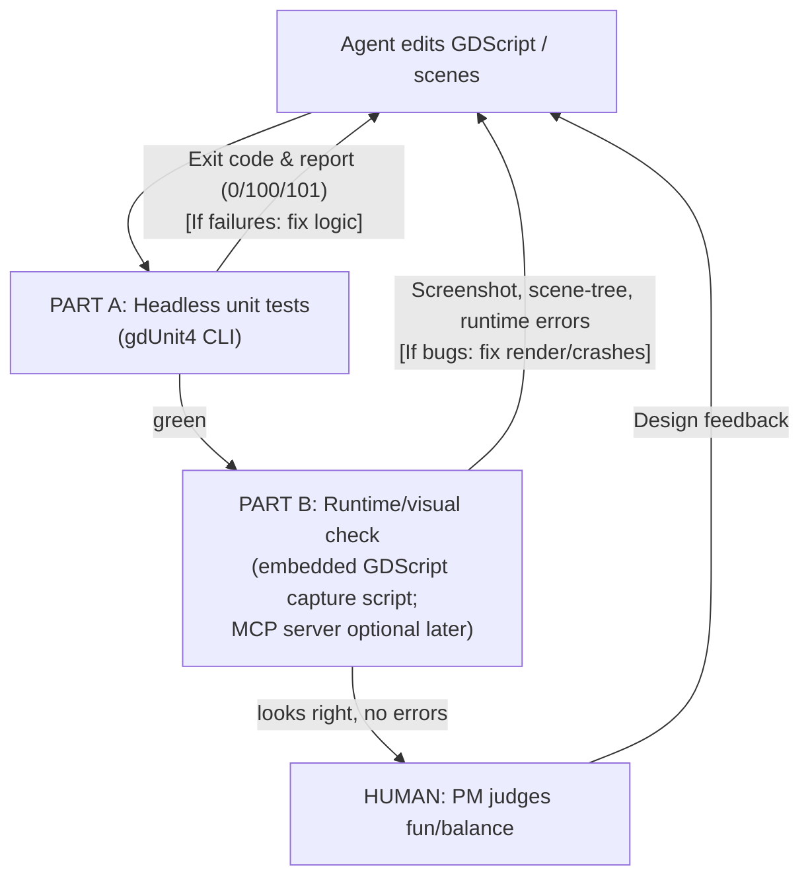
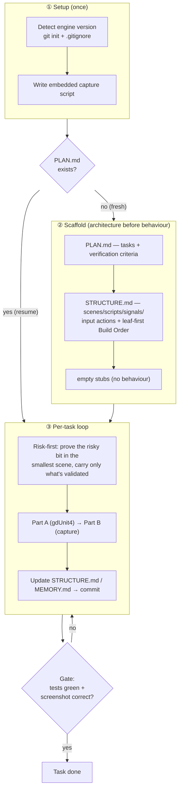

# Agent Development Loop & PoC Plan

> **Purpose:** the canonical reference for *how an AI agent develops, runs, observes, and self-corrects this game*.  
> **Status:** Pre-PoC. Engine decision is locked, but **NOT yet proven on this machine for Godot**. See [Open Items](#open-items--verify-on-this-machine).  
> **Maintain this doc:** when you complete a step, run a command that works/fails, or learn something that contradicts what's written here, **update the relevant section and add a line to the [Changelog](#changelog)**. Do not let this drift from reality.

Last updated: 2026-06-17.

---

## 1. What this game is (one paragraph)

A roguelike, turn-based, deckbuilding card game — Civilization (hex overworld + fog of war + exploration/events) crossed with Slay the Spire (build a card pool from room/event rewards), era/legacy progression, and a soft 3-hour run cap. Target platforms: **desktop and mobile**. Developer is a general programmer new to game development; art is **AI-generated — a self-generated, style-unified pack** (see [`art-pipeline-poc-guide.md`](./art-pipeline-poc-guide.md)), with third-party packs reserved only for asset types AI handles poorly. Full design lives in the Obsidian note `game ideas/遊戲靈感.md`; the engine decision audit lives in `game ideas/agent loops/2026-06-17-game-engine-tech-stack-audit.md`.

## 2. Locked decisions

| Decision | Value | Why (short) |
|---|---|---|
| **Engine** | **Godot 4.6**, **GDScript** (not C#) | Text-based `.tscn`/`.gd`/`.tres` are legible to an AI agent; small consistent API; native desktop **and** mobile; mature Steam integration; iOS C# export is experimental, GDScript is not. |
| **Art dimensionality** | **2D** | Best fit for AI-generated static card/tile art; sidesteps AI's weak frame-to-frame animation. |
| **Priorities (ranked)** | agent-writability > long-term scalability > open-source > fastest prototype | Drove the engine choice. |

These were decided with the user.

## 3. The core idea: a two-part self-correction loop

An AI agent cannot reliably build a game by writing code alone — **most game bugs only appear at runtime** (null references, signal ordering, physics layers silently not colliding, things rendering off-screen or behind other layers). The agent must be able to **run the game, observe it, and react to what it actually sees** — otherwise it "rationalizes away" defects because the code compiled. (This is the central lesson from the autonomous-Godot project [godogen](https://github.com/htdt/godogen): *"judge progress from captured screenshots, not from code that compiles."*)

For this **turn-based** game, the loop has two parts with very different weights:

### Part A — Logic verification (the backbone, ~70% of self-checking)
Deck rules, fog reveal, pathfinding, resource economy, event resolution, run-length math. These are **deterministic** and should be pushed into **pure functions** that run **headless** (no graphics) under a unit-test framework. The agent runs the tests, reads pass/fail, and fixes — fully autonomously, fast, no GUI. **This is the source of truth.** See [§4](#4-logic-verification-headless-unit-tests).

### Part B — Visual / runtime verification (~30%)
"Did the card actually render? Is the hex highlighted? Did the fog reveal? Did anything crash at runtime?" This needs the agent to **launch the game, capture what it actually renders, and read runtime errors** — and, when needed, inspect the live scene and inject input. The **primary** mechanism for this project is an **embedded GDScript capture script** (the proven, dependency-free pattern); a visual Godot MCP server is an **optional enhancement** layered on once the loop is proven (see [§5](#5-visual--runtime-verification-part-b-mechanisms)).

> **The 70/30 weighting is an estimate, not a measurement.** Recalibrate during the PoC: if Part B is catching a large share of defects (say >40%), invest more in the visual path before scaling up.

**Screenshot-review checklist — actively hunt these, don't just confirm "it rendered"** (defect taxonomy from [godogen](https://github.com/htdt/godogen)):
- **Clipping** — elements cut off or overlapping wrongly.
- **Wrong scale** — a sprite/tile too big or small relative to others.
- **Frozen motion** — something that should update/animate is static (within the limits of still-frame review).
- **Missing assets** — blank/placeholder/magenta where art should be.
- **Z-index / anchoring** — present in the scene tree but off-screen or behind another layer.

Judge progress from what the screenshot *shows*, not from the fact that the code compiled.

### Human in the loop: game feel & balance
The agent verifies *correctness* (the rule fires, it renders, it doesn't crash). The **human stays in the loop for feel** — is the 3-hour run satisfying, is the economy fair, is the difficulty curve right. 

## 4. Logic verification: headless unit tests

### Framework choice: gdUnit4 (recommended) or GUT
Both are actively maintained (2026) and run headless from the command line.

- **[gdUnit4](https://github.com/godot-gdunit-labs/gdUnit4)** — recommended here. Designed with CI in mind: ships a CLI runner, generates **JUnit XML** (`results.xml`) + **HTML** (`index.htm`) reports, has a [GitHub Action (`gdunit4-action`)](https://github.com/marketplace/actions/gdunit4-test-runner-action), supports GDScript **and** C#, auto-discovers tests. ([CLI docs](https://godot-gdunit-labs.github.io/gdUnit4/latest/advanced_testing/cmd/))
- **[GUT](https://github.com/bitwes/Gut)** — the older, battle-tested option. Stronger mocking/spies/stubs and community code-coverage addons. Pick this only if you specifically need those.

> Recommendation: **gdUnit4**, for its CI ergonomics and report formats. Revisit only if mocking/coverage gaps bite.

### Exact commands (verify on this machine — see Open Items)

**gdUnit4** (its documented runner script):
```bash
export GODOT_BIN=/Applications/Godot.app/Contents/MacOS/Godot
chmod +x ./addons/gdUnit4/runtest.sh
./addons/gdUnit4/runtest.sh -a res://test
```
- Key flags: `-a` add test dir/suite · `-i` ignore a suite/case · `-c` continue past first failure · `-rd` report dir.
- **Exit codes: `0` = all pass, `100` = failures, `101` = warnings.** CI keys off these.
- Reports written to `res://reports/` by default.

**GUT** (Godot-4 headless form):
```bash
/Applications/Godot.app/Contents/MacOS/Godot --headless --path . \
  -s addons/gut/gut_cmdln.gd -gdir=res://test -ginclude_subdirs -gexit
```
- `--headless` = no window/GPU · `-gexit` = exit after the run (required so the process returns the test result, not the engine shutdown status).

### Headless CI gotchas — these will waste hours if not known up front
Sourced from Godot engine issues; treat as load-bearing:

1. **The `.godot/` import cache is not committed**, so a fresh checkout (or fresh clone by an agent) has no imported resources. You must do a **clean import pass first**, then run tests — a two-step job:
   ```bash
   # step 1: warm up the import cache (note --quit-after 2000, not --quit)
   $GODOT_BIN --headless --path . --import --quit-after 2000
   # step 2: run tests (commands above)
   ```
2. **First headless import can exit with code 1 even on success** ([godot#83449](https://github.com/godotengine/godot/issues/83449)), and `--quit` / `--quit-after 1` could fail to import while `--quit-after 2` works ([godot#77508](https://github.com/godotengine/godot/issues/77508) — **closed/fixed in 4.3**, so on Godot 4.6 the `--quit-after 2000` warm-up may no longer be strictly necessary; keep it as a harmless safety belt but **verify, don't assume**). Don't trust the import step's exit code; gate CI on the *test* step's exit code.
3. **Set `GODOT_DISABLE_LEAK_CHECKS=1`** in the test environment to avoid false-positive non-zero exits from Godot's shutdown leak checker.
4. **Headless ≠ rendering.** Tests can pass headless while the game crashes under a real GPU (shader compile errors, GPU-specific issues). Part B (visual verification) is what catches these — headless tests alone are not sufficient sign-off.

### Design rule that makes this work
**Push game logic out of nodes and into plain, dependency-free GDScript** (pure functions / `RefCounted` classes operating on data). A rule like "play card → new game state" should be testable without instantiating a scene. The more logic lives in pure functions, the more of the game the agent can verify with zero GUI.

### Runtime assertions for the visual path (`ASSERT PASS/FAIL`)
For behaviour that's hard to judge from a still — exact positions, velocities, state transitions — have the Part B capture script print `ASSERT PASS: ...` / `ASSERT FAIL: ...` to stdout alongside the screenshots (the godogen convention). The agent then **greps stdout for any `ASSERT FAIL` and treats it as a blocker**, even when the frame looks fine. This complements gdUnit4 (which owns pure-logic checks) by catching scene-context regressions the unit tests can't see.

## 5. Visual / runtime verification (Part B): mechanisms

Part B needs the agent to launch the game, capture what it actually renders, read runtime errors, and (ideally) inspect the live scene tree and inject input. There are two ways to get this. **For this project we lead with the simpler one** and treat the server as an upgrade.

### Primary: an embedded GDScript capture script (start here)
Embed a small **GDScript capture helper** in the project that, on a key press / signal / autostart, writes a **PNG screenshot** — and optionally a **scene-tree / state dump** (JSON) — to disk for the agent to read. This is the engine-native pattern the autonomous-Godot project [godogen](https://github.com/htdt/godogen) actually uses (C# there; GDScript for us) to do frame-grounded self-repair — **without any MCP server.**

Why primary, for a loop-proving PoC:
- **Dependency-free** — no Node.js, no external server, no addon; nothing to install or keep in sync with engine versions.
- **Fully under our control** — our code in our repo; it can't silently break on an upstream update.
- **Matches the proven reference** — godogen closes this exact loop this way.

Capture deterministically: fixed FPS, and **pre-position the camera before the first captured frame** (the first frame renders before `_process` runs). Limitation: it's lower-level than a server — no *live* input injection or interactive scene queries; the agent sees what the script chose to dump. For the PoC's "render it, screenshot it, read errors" loop that is enough.

### Enhancement (adopt once the loop is proven): a visual Godot MCP server
A "Godot MCP server" is a bridge that lets an external agent command a running Godot instance. Its payoff over the embedded script (per [Summer Engine's 2026 guide](https://www.summerengine.com/blog/claude-for-godot)) is querying the **live scene tree** and **injecting input** interactively, instead of only reading pre-scripted dumps. Add this **after** the basic loop closes, if/when interactive queries or input injection are worth the dependency.

**Capability, not price, is the real dividing line.** Verify the specific repo's feature list at install time (names collide; tool counts are quoted inconsistently).

- **Console-only servers** (run the game + read errors, but "blind" — no screenshot/input/scene-tree): [Coding-Solo/godot-mcp](https://github.com/Coding-Solo/godot-mcp) (free, ~13 tools). The embedded script already covers errors, so these add little here.
- **Visual servers** (screenshot + input injection + live scene-tree):
  - [godot-mcp-runtime (Erodenn)](https://github.com/Erodenn/godot-mcp-runtime) — free/OSS, the one to try first if we add a server. "Zero-footprint": injects a temporary `McpBridge` autoload on launch, commits nothing to the repo. Setup: Node.js 20+, Godot 4.x on PATH.
  - [GoPeak (had0yun)](https://mcpservers.org/servers/had0yun/godot-mcp) — free, broader; adds DAP step-debugging, but needs an in-project addon + socket on port 7777 (older versions time out on large inline screenshots).
  - GDAI MCP (free) — screenshots + keyboard simulation; addon-based.
  - "Godot MCP Pro" (~$5) — most tool *breadth*; the loop is already covered without it.

> **Why this is the enhancement, not the default:** much of the 2026 "MCP server" category is *file-level editor automation that cannot observe the running game at all*; only the **visual/runtime** servers above can, and they're newer and prone to churn. Confirm a candidate actually screenshots the *running* game on this Mac before relying on it.

### Headless test-running is NOT a Part-B feature
Neither the capture script nor an MCP server is your test runner. Run gdUnit4/GUT via the **CLI** ([§4](#4-logic-verification-headless-unit-tests)); Part B is for *runtime/visual* checks only.

## 6. The loop, end to end — and agent working conventions

### 6a. The self-correction loop



### 6b. Scaffolding & durable state (from godogen)

The loop above runs many times across long, compaction-prone sessions. To survive that, keep working state in **files, not chat**, and follow a fixed scaffold order.



**Durable state files** (so a fresh or post-compaction agent resumes from artifacts, not memory):

| File | Holds |
|---|---|
| `PLAN.md` | task list + per-task verification criteria + status; **its existence = "resume, skip scaffold"** |
| `STRUCTURE.md` | architecture: scenes / scripts / signals / input actions, plus a **leaf-first Build Order** |
| `MEMORY.md` | quirks / workarounds discovered while building (append-only) |
| `ASSETS.md` | asset manifest (paths, generation details) — see the art guide |

**Conventions:**
- **Leaf-first Build Order** — `STRUCTURE.md` lists the exact build sequence (child scenes before parents); follow it mechanically, don't infer dependencies.
- **Risk-first slice** — when a task has one uncertain part, isolate it in the smallest possible scene/script and prove or disprove it *before* the main build; carry only the validated pattern forward.
- **Commit after each green task**, updating `STRUCTURE.md` / `MEMORY.md` first, so the loop can always resume from a clean artifact.

## 7. Environment setup (on the developer's Mac — cannot be done in a headless agent session)

1. **Install Godot 4.6 — standard (GDScript) build**, not the .NET/C# build.
2. **`git init`** in this project root (currently not a git repo).
3. **Add gdUnit4** as an addon; get **one trivial headless test passing from the CLI** (prove Part A first).
4. **Write `CLAUDE.md`** at the project root pinning Godot 4.6 idioms (`await` not `yield`; `CharacterBody2D` not `KinematicBody2D`; static typing; signal-naming conventions) and the test/loop commands from this doc. Consider also authoring a **`godot-api` domain skill** under `.claude/skills/` that pins engine API knowledge — the scaffold pattern [godogen](https://github.com/htdt/godogen) ships (`CLAUDE.md` + `.claude/skills/`, plus `AGENTS.md` for Codex).
5. **Write the embedded GDScript capture script** (no install needed); first milestone = **get it to launch a scene and write one screenshot PNG to disk** on this hardware (prove Part B before building on it). Defer installing a visual MCP server (godot-mcp-runtime, Node.js 20+) until the basic loop is proven and interactive scene queries / input injection are actually needed.
6. Only then start the PoC vertical slice ([§8](#8-poc-plan-vertical-slice)).

## 8. PoC plan (vertical slice)

Goal of the PoC is **not** game content — it is to **prove the full loop closes on this machine** with the smallest real slice.

- [ ] Repo + git initialized; `CLAUDE.md` written.
- [ ] gdUnit4 installed; trivial headless test green from CLI (Part A proven). **Guard against false-greens:** confirm the run actually executed ≥1 test (non-zero test count / at least one PASS line) — gdUnit4 can exit `0` on "no tests found".
- [ ] Embedded GDScript capture script writes a screenshot PNG of a launched scene to disk (Part B proven). (Visual MCP server deferred — see [§5](#5-visual--runtime-verification-part-b-mechanisms).)
- [ ] One **pure-function rule** with a gdUnit4 test, e.g. `play_card(state, card) -> new_state` changes resources deterministically.
- [ ] One **scene** that draws 1 card + 1 hex tile and reflects that state visually.
- [ ] Run the whole loop once on a deliberately-broken change: edit → test catches logic bug → fix → capture-script screenshot catches a render bug → fix → green + correct render.
- [ ] Record the result (timings, what worked, what didn't) back into this doc's Changelog.

After the PoC closes, expand toward the first real subsystem (recommended order: card/deck data model → one hex tile + fog reveal → one room/event resolving to a card reward).

## 9. Pitfalls (verified, agent-relevant)

| Pitfall | Mitigation |
|---|---|
| **Runtime-only bugs** (null refs, signal ordering, physics layers silently not colliding) | Part B visual/runtime check; never sign off on headless tests alone. |
| **Z-index / anchoring blindness** — element exists in the scene tree but renders off-screen or behind another layer | Screenshot review, not just scene-tree assertion. |
| **Temporal blindness** — agent misses animation snapping, jitter, frame-pacing from stills | Keep card art static (already the plan); human reviews motion/feel. |
| **Headless passes but GPU run crashes** (shader/Signal 11) | Run Part B under real rendering before declaring done. |
| **Hallucinating Godot 3 syntax** | `CLAUDE.md` pins Godot 4.6 idioms; gdUnit4 tests catch silent failures. |
| **UID corruption** — hand-editing `.tscn` breaks Godot's `uid://` dependency tracking | Prefer editing scenes via the Godot editor / scene-builder scripts over raw `.tscn` rewrites. |
| **Headless import exit-code-1 / `--quit` import failure** | Two-step import warm-up + `GODOT_DISABLE_LEAK_CHECKS=1` ([§4](#4-logic-verification-headless-unit-tests)). |

## 10. Open items / verify on this machine
Everything below is **unverified by me** (I have no Godot installed in the agent session). A future agent or the PM must confirm:
- [ ] Exact gdUnit4 `runtest.sh` invocation + exit codes on **this** Godot 4.6 / macOS install (agy suggested a `--run-gdunit-tests` flag; the official docs use `runtest.sh` — trust the docs, but confirm empirically).
- [ ] The embedded GDScript capture script writes a correct screenshot of a launched scene on **this** Mac/GPU (the primary Part B path). godot-mcp-runtime is only verified later, if/when we add it.
- [ ] Whether the two-step headless import warm-up is still needed on Godot 4.6 (godot#77508 is fixed in 4.3) or only the exit-code-1 trap (godot#83449) remains.
- [ ] Whether GoPeak's step-debugging is worth the addon footprint for this project.

## 11. References (all fetched/verified 2026-06-17)
- Autonomous Godot agent loop (frame-grounded self-repair): https://github.com/htdt/godogen
- Claude Code + Godot 2026 best practices & MCP value: https://www.summerengine.com/blog/claude-for-godot
- In-editor agent vs file-level MCP (why runtime observation differs): https://www.summerengine.com/blog/godot-ai-agent-guide · https://www.summerengine.com/blog/best-ai-tools-for-godot
- gdUnit4: https://github.com/godot-gdunit-labs/gdUnit4 · CLI docs: https://godot-gdunit-labs.github.io/gdUnit4/latest/advanced_testing/cmd/
- GUT: https://github.com/bitwes/Gut
- Godot headless import gotchas: https://github.com/godotengine/godot/issues/83449 · https://github.com/godotengine/godot/issues/77508
- Godot MCP servers — Coding-Solo (console-only): https://github.com/Coding-Solo/godot-mcp · godot-mcp-runtime (visual, zero-footprint): https://github.com/Erodenn/godot-mcp-runtime · GoPeak (visual + DAP): https://mcpservers.org/servers/had0yun/godot-mcp · landscape comparison: https://ziva.sh/blogs/best-ai-tools-for-godot-2026

## Changelog
- **2026-06-17** — Doc created. Engine locked (Godot 4.6/GDScript/2D). Web loop proven in a prior session via Puppeteer MCP. Godot loop researched and specified; **not yet run on hardware** — see Open Items.
- **2026-06-17** — Folded in godogen extractions: Part B screenshot-review defect taxonomy (§3), GDScript capture-helper fallback (§5), `godot-api` skill scaffold note (§7); aligned §1 art description with the art guide's self-generated-pack shift.
