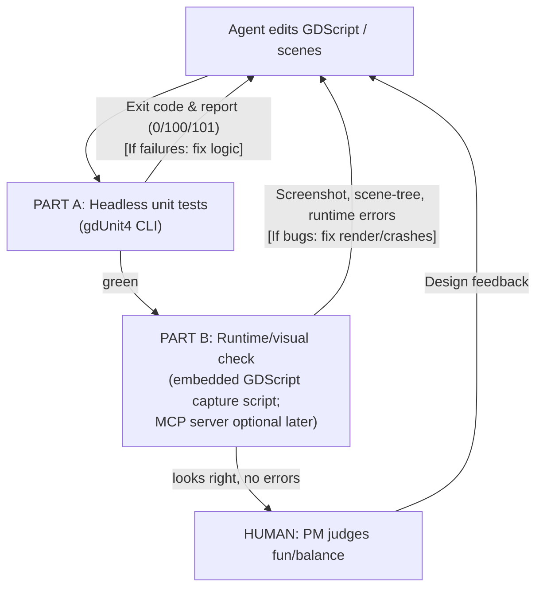

# Agent Development Loop (canonical)

> **Purpose:** the canonical reference for *how an AI agent develops, runs, observes, and self-corrects this game*: the two-part loop, why it exists, its known limits, and the practices that make it scale. It is doctrine, deliberately project-generic.
> **Division of labor:** the verified per-project commands and pitfalls live in `insignificant-game/docs/dev-loop.md`; the task board in `insignificant-game/docs/PLAN.md`; the architecture contract in `insignificant-game/docs/architecture.md`. This doc holds the *why* and the transferable mechanics.
> **Status:** proven end to end on this hardware (Godot 4.6.3, macOS, Apple Silicon, Metal/Forward+) with a deliberately-broken change: a logic bug caught headless and a visual bug caught at the screenshot layer, both fixed, gate green. It is the standing loop for ongoing development.
> **Verdict (see [§8](#8-long-term-suitability--scaling-the-verdict)):** the right long-term backbone, but it verifies *correctness*, not *fun*, and Part B (visual) is blind to motion/feel. The two limits to plan around: **fun/balance can never be agent-verified** (human-owned, and the real throughput ceiling), and **Part B needs an upgrade when animation/interaction arrive.**
> **Maintain this doc:** when reality contradicts what's written here, update the relevant section in place. History belongs in git commit messages, not in this file.

---

## 1. What this game is (one paragraph)

A roguelike, turn-based, deckbuilding civilization-management game (**Insignificant**). The full design lives in `insignificant-game/design/` (the single source of truth); don't restate it here. Target platforms: **desktop and mobile**. Art is **AI-generated as a self-generated, style-unified pack** (see [`image-assets-generation-orchestrator-cookbook.md`](./image-assets-generation-orchestrator-cookbook.md)), with third-party packs reserved only for asset types AI handles poorly.

## 2. Locked decisions

| Decision | Value | Why (short) |
|---|---|---|
| **Engine** | **Godot 4.6**, **GDScript** (not C#) | Text-based `.tscn`/`.gd`/`.tres` are legible to an AI agent; small consistent API; native desktop **and** mobile; mature Steam integration; iOS C# export is experimental, GDScript is not. |
| **Art dimensionality** | **2D** | Best fit for AI-generated static card/tile art; sidesteps AI's weak frame-to-frame animation. |
| **Priorities (ranked)** | agent-writability > long-term scalability > open-source > fastest prototype | Drove the engine choice. |

These were decided with the user.

## 3. The core idea: a two-part self-correction loop

An AI agent cannot reliably build a game by writing code alone — **most game bugs only appear at runtime** (null references, signal ordering, physics layers silently not colliding, things rendering off-screen or behind other layers). The agent must be able to **run the game, observe it, and react to what it actually sees** — otherwise it "rationalizes away" defects because the code compiled. (This is the central lesson from the autonomous-Godot project [godogen](https://github.com/htdt/godogen): *"judge progress from captured screenshots, not from code that compiles."*)

For this **turn-based** game, the loop has two parts with very different weights:

### Part A — Logic verification (the backbone, ~70% of self-checking)
Deck rules, fog reveal, pathfinding, resource economy, event resolution, run-length math. These are **deterministic** and should be pushed into **pure functions** that run **headless** (no graphics) under a unit-test framework. The agent runs the tests, reads pass/fail, and fixes — fully autonomously, fast, no GUI. **This is the source of truth.** See [§4](#4-logic-verification-headless-unit-tests).

### Part B — Visual / runtime verification (~30%)
"Did the card actually render? Is the hex highlighted? Did the fog reveal? Did anything crash at runtime?" This needs the agent to **launch the game, capture what it actually renders, and read runtime errors** — and, when needed, inspect the live scene and inject input. The **primary** mechanism for this project is an **embedded GDScript capture script** (the proven, dependency-free pattern); a visual Godot MCP server is an **optional enhancement** layered on once the loop is proven (see [§5](#5-visual--runtime-verification-part-b-mechanisms)).

> **The 70/30 weighting is an estimate, not a measurement.** Treat recalibration as a **standing long-term task**: track which layer actually catches each *real* defect as subsystems land, and if Part B's share climbs past ~40%, invest in the visual path (richer ASSERTs, multi-frame capture, or the MCP upgrade in [§5](#5-visual--runtime-verification-part-b-mechanisms)) before scaling further. See [§8](#8-long-term-suitability--scaling-the-verdict).

**Screenshot-review checklist — actively hunt these, don't just confirm "it rendered"** (defect taxonomy from [godogen](https://github.com/htdt/godogen)):
- **Clipping** — elements cut off or overlapping wrongly.
- **Wrong scale** — a sprite/tile too big or small relative to others.
- **Frozen motion** — something that should update/animate is static (within the limits of still-frame review).
- **Missing assets** — blank/placeholder/magenta where art should be.
- **Z-index / anchoring** — present in the scene tree but off-screen or behind another layer.

Judge progress from what the screenshot *shows*, not from the fact that the code compiled.

### Human in the loop: game feel & balance
The agent verifies *correctness* (the rule fires, it renders, it doesn't crash). The **human stays in the loop for feel** — is the run satisfying, is the economy fair, is the difficulty curve right.

## 4. Logic verification: headless unit tests

### Framework: gdUnit4
[gdUnit4](https://github.com/godot-gdunit-labs/gdUnit4) is the framework: designed with CI in mind, ships a CLI runner, generates **JUnit XML** + **HTML** reports, has a [GitHub Action (`gdunit4-action`)](https://github.com/marketplace/actions/gdunit4-test-runner-action), auto-discovers tests. ([CLI docs](https://godot-gdunit-labs.github.io/gdUnit4/latest/advanced_testing/cmd/)) The alternative, [GUT](https://github.com/bitwes/Gut), has stronger mocking/spies/stubs and community coverage addons; revisit only if those gaps bite.

The exact verified invocations, exit codes, and report paths for this repo live in `insignificant-game/docs/dev-loop.md`. Doctrine-level facts that hold wherever the loop is reproduced:

- Gate on the **exit code AND the executed-suite count** — gdUnit4 can exit `0` on "no tests found".
- The CLI **aborts the remaining cases in a suite after one fails**, and the "failures" count tallies *assertions*, not cases: keep suites small, or pass `-c` to continue.

### Headless CI gotchas — these will waste hours if not known up front
Sourced from Godot engine issues; treat as load-bearing:

1. **The `.godot/` import cache is not committed**, so a fresh checkout has no imported resources. Do a **clean import pass first** (`--headless --import --quit-after 2000`), then run tests — a two-step job.
2. **The import warm-up is load-bearing for the global class cache:** when you add a **new `class_name` script**, tests that reference it fail discovery with **exit `105`** ("Identifier … not declared") until an `--import` pass rebuilds the cache. Run the warm-up after adding any `class_name`. Don't trust the import step's own exit code (historical traps: [godot#83449](https://github.com/godotengine/godot/issues/83449), [godot#77508](https://github.com/godotengine/godot/issues/77508)); gate CI on the *test* step's exit code.
3. **Set `GODOT_DISABLE_LEAK_CHECKS=1`** in the test environment to avoid false-positive non-zero exits from Godot's shutdown leak checker.
4. **Headless ≠ rendering.** Tests can pass headless while the game crashes under a real GPU (shader compile errors, GPU-specific issues). Part B is what catches these — headless tests alone are not sufficient sign-off.

### Design rule that makes this work
**Push game logic out of nodes and into plain, dependency-free GDScript** (pure functions / `RefCounted` classes operating on data). A rule like "play card → new game state" should be testable without instantiating a scene. The more logic lives in pure functions, the more of the game the agent can verify with zero GUI.

### Runtime assertions for the visual path (`ASSERT PASS/FAIL`)
For behaviour that's hard to judge from a still — exact positions, velocities, state transitions — have the Part B capture script print `ASSERT PASS: ...` / `ASSERT FAIL: ...` to stdout alongside the screenshots (the godogen convention). The agent then **greps stdout for any `ASSERT FAIL` and treats it as a blocker**, even when the frame looks fine. This complements gdUnit4 (which owns pure-logic checks) by catching scene-context regressions the unit tests can't see.

## 5. Visual / runtime verification (Part B): mechanisms

Part B needs the agent to launch the game, capture what it actually renders, read runtime errors, and (ideally) inspect the live scene tree and inject input. There are two ways to get this. **This project leads with the simpler one** and treats the server as an upgrade.

### Primary: an embedded GDScript capture script (the shipped mechanism)
Embed a small **GDScript capture helper** in the project that, on a key press / signal / autostart, writes a **PNG screenshot** — and optionally a **scene-tree / state dump** (JSON) — to disk for the agent to read. This is the engine-native pattern the autonomous-Godot project [godogen](https://github.com/htdt/godogen) actually uses to do frame-grounded self-repair — **without any MCP server.**

Why primary:
- **Dependency-free** — no Node.js, no external server, no addon; nothing to install or keep in sync with engine versions.
- **Fully under our control** — our code in our repo; it can't silently break on an upstream update.
- **Matches the proven reference** — godogen closes this exact loop this way.

Capture deterministically: fixed FPS, and **pre-position the camera before the first captured frame** (the first frame renders before `_process` runs). Limitation: it's lower-level than a server — no *live* input injection or interactive scene queries; the agent sees what the script chose to dump. For a "render it, screenshot it, read errors" loop that is enough.

### Enhancement (adopt if interactive queries become load-bearing): a visual Godot MCP server
A "Godot MCP server" is a bridge that lets an external agent command a running Godot instance. Its payoff over the embedded script (per [Summer Engine's 2026 guide](https://www.summerengine.com/blog/claude-for-godot)) is querying the **live scene tree** and **injecting input** interactively, instead of only reading pre-scripted dumps. Add this only if/when interactive queries or input injection are worth the dependency.

**Capability, not price, is the real dividing line.** Verify the specific repo's feature list at install time (names collide; tool counts are quoted inconsistently).

- **Console-only servers** (run the game + read errors, but "blind" — no screenshot/input/scene-tree): [Coding-Solo/godot-mcp](https://github.com/Coding-Solo/godot-mcp) (free, ~13 tools). The embedded script already covers errors, so these add little here.
- **Visual servers** (screenshot + input injection + live scene-tree):
  - [godot-mcp-runtime (Erodenn)](https://github.com/Erodenn/godot-mcp-runtime) — free/OSS, the one to try first if we add a server. "Zero-footprint": injects a temporary `McpBridge` autoload on launch, commits nothing to the repo. Setup: Node.js 20+, Godot 4.x on PATH.
  - [GoPeak (had0yun)](https://mcpservers.org/servers/had0yun/godot-mcp) — free, broader; adds DAP step-debugging, but needs an in-project addon + socket on port 7777 (older versions time out on large inline screenshots). Whether the step-debugging is worth the addon footprint is an open call; no server has been needed so far.
  - GDAI MCP (free) — screenshots + keyboard simulation; addon-based.
  - "Godot MCP Pro" (~$5) — most tool *breadth*; the loop is already covered without it.

> **Why this is the enhancement, not the default:** much of the 2026 "MCP server" category is *file-level editor automation that cannot observe the running game at all*; only the **visual/runtime** servers above can, and they're newer and prone to churn. Confirm a candidate actually screenshots the *running* game on this Mac before relying on it.

### Headless test-running is NOT a Part-B feature
Neither the capture script nor an MCP server is your test runner. Run gdUnit4 via the **CLI** ([§4](#4-logic-verification-headless-unit-tests)); Part B is for *runtime/visual* checks only.

## 6. The loop, end to end — and agent working conventions

### 6a. The self-correction loop

### 6b. Scaffolding & durable state (from godogen)

The loop above runs many times across long, compaction-prone sessions. To survive that, keep working state in **files, not chat**: a fresh or post-compaction agent resumes from artifacts, not memory. The godogen pattern names four state files; this repo instantiates each of them:

| Pattern (godogen) | Holds | This repo's instantiation |
|---|---|---|
| `PLAN.md` | task list + per-task verification criteria + status; its existence = "resume, don't re-scaffold" | `insignificant-game/docs/PLAN.md` |
| `STRUCTURE.md` | architecture: module map, boundaries, build order | `insignificant-game/docs/architecture.md` (the contract) |
| `MEMORY.md` | quirks / workarounds discovered while building | `insignificant-game/docs/dev-loop.md` pitfalls + cookbook §14 findings log |
| `ASSETS.md` | asset manifest (paths, generation details) | `insignificant-game/assets/pipeline/inventory.md` + `style-bible.md` |

**Conventions:**
- **Leaf-first build order** — build child scenes/modules before parents; follow the recorded order mechanically, don't infer dependencies.
- **Risk-first slice** — when a task has one uncertain part, isolate it in the smallest possible scene/script and prove or disprove it *before* the main build; carry only the validated pattern forward.
- **Commit after each green task**, updating the durable state files first, so the loop can always resume from a clean artifact.

## 7. Pitfalls (verified, agent-relevant)

| Pitfall | Mitigation |
|---|---|
| **Runtime-only bugs** (null refs, signal ordering, physics layers silently not colliding) | Part B visual/runtime check; never sign off on headless tests alone. |
| **Z-index / anchoring blindness** — element exists in the scene tree but renders off-screen or behind another layer | Screenshot review, not just scene-tree assertion. |
| **Temporal blindness** — agent misses animation snapping, jitter, frame-pacing from stills | Keep card art static (already the plan); human reviews motion/feel. |
| **Headless passes but GPU run crashes** (shader/Signal 11) | Run Part B under real rendering before declaring done. |
| **Hallucinating Godot 3 syntax** | `CLAUDE.md` pins Godot 4.6 idioms; gdUnit4 tests catch silent failures. |
| **UID corruption** — hand-editing `.tscn` breaks Godot's `uid://` dependency tracking | Prefer editing scenes via the Godot editor / scene-builder scripts over raw `.tscn` rewrites. |
| **Headless import exit-code traps** | Two-step import warm-up + `GODOT_DISABLE_LEAK_CHECKS=1` ([§4](#4-logic-verification-headless-unit-tests)). |
| **Stale global class cache** — tests can't see a newly-added `class_name` (parse error, exit `105`) until re-import | Run the `--import` warm-up after adding any `class_name`, *then* run tests ([§4](#4-logic-verification-headless-unit-tests)). |
| **Suite masking** — gdUnit4 aborts the rest of a suite after the first failing case, hiding later cases | Gate on the exit code, keep suites small, or pass `-c` to continue past failures ([§4](#4-logic-verification-headless-unit-tests)). |

## 8. Long-term suitability & scaling (the verdict)

**Verdict: yes — this loop is the long-term backbone — but it verifies *correctness*, never *fun*, and its visual half has a known ceiling.** The points below extrapolate the proven method to a full game, and should be read as conditions, not guarantees.

### What scales well (lean on it)
- **Part A (pure-function logic).** A turn-based deckbuilder is overwhelmingly deterministic — deck rules, resource economy, fog/visibility, event resolution, run-length math. Pushed into pure `RefCounted`/static functions, these are fast, headless, fully autonomous to verify, and cheap to keep green. **This is the durable foundation; the more logic lives here, the more of the game the agent can self-correct.**
- **Objective gates.** Exit codes + reports + `ASSERT PASS/FAIL` give un-rationalizable signals. This is what stops "it compiled" hand-waving, and it holds at any scale.
- **Durable state + resumability** ([§6b](#6b-scaffolding--durable-state-from-godogen)) survive long, compaction-prone sessions — essential for a multi-month build.

### What does NOT scale on its own (plan around it)
- **Part B is stills-only.** It catches static defects (clipping, z-order, off-screen, missing assets, wrong scale) but is **blind to motion, timing, transitions, juice, and audio.** The deliberately-static card art keeps this mostly fine *today*; every animation/interaction added shrinks Part B's coverage. **Upgrade trigger:** when interactive/animated feedback becomes load-bearing, move Part B to multi-frame/video capture or the visual MCP server's input injection + live scene-tree ([§5](#5-visual--runtime-verification-part-b-mechanisms)) — don't keep trusting a single frame.
- **Fun/balance is unverifiable, forever.** The agent confirms a rule fires, renders, and doesn't crash — never whether the run is satisfying or the economy fair. **Human review is the real throughput ceiling, and it grows with content, not with agent speed.** The loop accelerates correctness; it does not accelerate design.
- **Combinatorial content.** Card × relic × event interactions explode beyond enumerable unit tests. Per-rule tests stay necessary but insufficient.
- **Self-judged screenshots.** The agent grading its own PNGs can still err; ASSERTs reduce this, but aesthetic correctness still needs human spot-checks.

### Scaling practices to adopt as subsystems land
- **Design for testability up front:** seedable/deterministic RNG, data-driven content, logic kept out of nodes. *(Guardrail: logic leaking back into scene nodes is the single biggest threat to Part A coverage — flag it in review.)*
- **Add simulation & property tests** for combinatorial behaviour: auto-play N *seeded* runs and assert invariants (no negative resources, run terminates, economy stays in bounds), plus gdUnit4 fuzzers for rule inputs. This covers what enumerated cases can't.
- **CI + regression suite:** wire the [`gdunit4-action`](https://github.com/marketplace/actions/gdunit4-test-runner-action); keep suites small and fast. Per-loop wall-clock is dominated by the ~2 s import + GPU launch, not the checks — batch Part B captures and cache `.godot` to keep it tight.
- **Recalibrate the 70/30** ([§3](#3-the-core-idea-a-two-part-self-correction-loop)) from real defect data; let evidence, not the estimate, decide how much to invest in the visual path.

### Bottom line
Recommended for the long term **as a correctness engine**, conditional on: (1) keeping logic pure/testable, (2) upgrading Part B when motion/feel arrive, and (3) accepting that human design review — not the agent — sets the pace once content scales.

## 9. References (all fetched/verified 2026-06-17)
- Autonomous Godot agent loop (frame-grounded self-repair): https://github.com/htdt/godogen
- Claude Code + Godot 2026 best practices & MCP value: https://www.summerengine.com/blog/claude-for-godot
- In-editor agent vs file-level MCP (why runtime observation differs): https://www.summerengine.com/blog/godot-ai-agent-guide · https://www.summerengine.com/blog/best-ai-tools-for-godot
- gdUnit4: https://github.com/godot-gdunit-labs/gdUnit4 · CLI docs: https://godot-gdunit-labs.github.io/gdUnit4/latest/advanced_testing/cmd/
- GUT: https://github.com/bitwes/Gut
- Godot headless import gotchas: https://github.com/godotengine/godot/issues/83449 · https://github.com/godotengine/godot/issues/77508
- Godot MCP servers — Coding-Solo (console-only): https://github.com/Coding-Solo/godot-mcp · godot-mcp-runtime (visual, zero-footprint): https://github.com/Erodenn/godot-mcp-runtime · GoPeak (visual + DAP): https://mcpservers.org/servers/had0yun/godot-mcp · landscape comparison: https://ziva.sh/blogs/best-ai-tools-for-godot-2026
