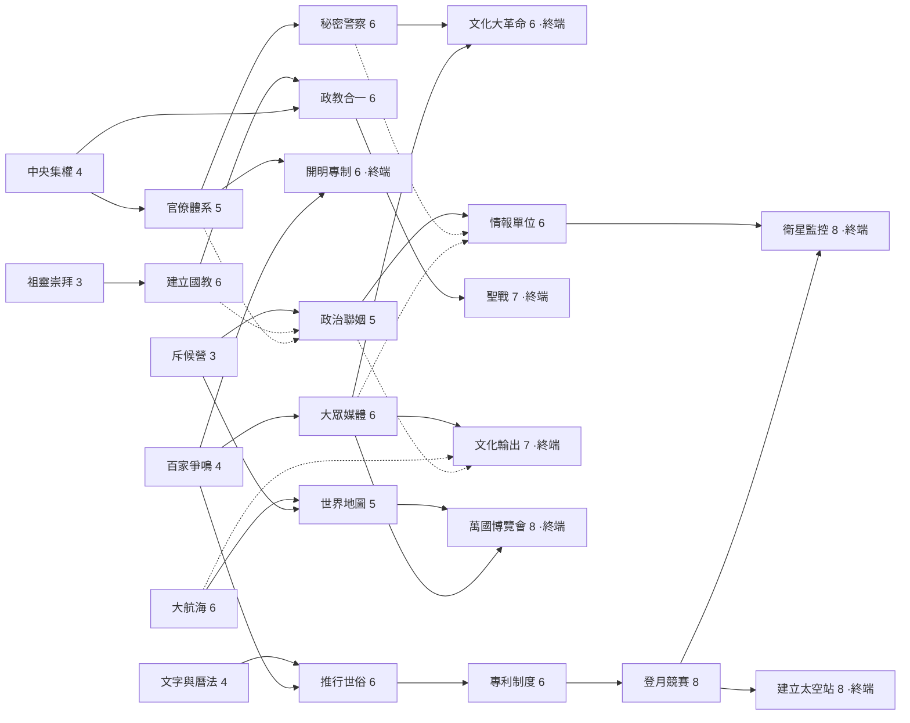

# 國策

> 政權核心上的長線大決定，組成一棵**國策樹**：六個主題——五個文明發展方向（**權力穩固、科技、文化、宗教、探索**）＋情報（**偵查**）。主題只是閱讀分組，**不是六條獨立鏈**：深處節點跨主題前置（政教合一要中央集權、文革要大眾媒體、衛星監控要登月競賽……），路線在中途交會——你為 A 終端買的節點，常常同時是 B 終端的半張門票。取捨在「先走哪條、走多深、共用哪些樞紐」。
> **不綁時代段**：節點沒有時代門檻，進度只由 BP 經濟自然節奏化（早期 BP 少、鎖不了多少）。
> 被誰餵：BP（[[營運]]）。餵給誰：[[Legacy]]（特定節點）、[[卡牌|國策限定卡]]、[[內亂與失敗|內亂權重]]、[[經濟與債務|稅收]]、[[戰鬥|投誠／賠償／開戰前情報]]、[[對手文明|心戰／影響力]]、[[地圖與機會|節點／迷霧]]、[[民主]]候選人池。

## 與營運的分工（認知邊界）

**建築管產出，國策管規則。** [[營運]]的建築線負責一切「+X／回合」的持續產出（錢、科技、文化、幸福、人口）；國策**不做持續產出**，只做**規則改寫**——權重、門檻、費用、解鎖、一次性大事件。玩家的心智模型：*要更多產出就蓋樓，要改變遊戲規則就推國策*。

- 全樹**沒有任何 +X／回合 節點**——持續產出一律在建築線上，國策效果一律是規則改寫或一次性事件。
- 建立國教的幸福 +30 保留：它是**一次性**大注入（隨時代衰退），不是每回合產出，屬於「大事件」不屬於「產線」。

## 研發規則

| 規則 | 值 | 備註 |
|---|---|---|
| 研發方式 | 鎖 BP 累計至節點成本 | 每回合鎖至多 2 BP、至少留 1 自由 BP |
| 同時研發 | 一次只研一個節點 | 換節點＝暫停，進度保留 |
| 前置 | 須完成節點列出的**全部**前置——常常跨主題 | 「＋」＝都要；「／」＝擇一即可。六個根節點（中央集權、文字與曆法、祖靈崇拜、百家爭鳴、大航海、斥候營）開局皆可選 |
| 世界大戰代 | 凍結：不鎖 BP、不進度 | |
| 民主後 | BP 停產＝國策樹凍結 | 進民主前想拿的節點要先拿 |
| 互斥 | **無**——任何節點都不互斥 | 願意花重複的 BP 就都拿得到；實際限制是 BP 預算（機會成本），不是封鎖 |
| Legacy | 特定節點完成即觸發 | 目前三個：建立國教→宗教教條、推行世俗→理性精神（可同局並存）、秘密警察→戒嚴（主動型，見 [[Legacy]]） |
| 國策限定卡 | 特定節點完成＝該卡入池 | 照付解卡費；**技能類限定卡用後即永久銷毀**、部隊類隨時代就地演化；卡參數在 [[卡牌]] |

## 國策樹

實線＝必要前置（＋）；虛線＝擇一前置（／）。

## 節點總表

| 主題 | 節點 | 前置 | 成本(BP) | 完成效果 | Legacy | 餵給誰 |
|---|---|---|---|---|---|---|
| 權力穩固 | **中央集權** | — | 4 | 內亂基礎權重 −5% | — | [[內亂與失敗]] |
| 權力穩固 | **官僚體系** | 中央集權 | 5 | 抽稅 +10% | — | [[經濟與債務]] |
| 權力穩固 | **秘密警察** | 官僚體系 | 6 | 內亂權重再 −10%；一次性幸福 −5 | **戒嚴**（主動型） | 內亂／[[幸福]]／[[Legacy]] |
| 權力穩固 | **文化大革命**（終端） | 秘密警察＋大眾媒體 | 6 | 幸福直接拉到 100；**人口永久 −20%** | — | 幸福／人口 |
| 權力穩固 | **開明專制**（終端） | 官僚體系＋百家爭鳴 | 6 | 幸福 +10；BP 結轉上限 2→3 | — | 幸福／[[營運]] |
| 科技 | **文字與曆法** | — | 4 | 卡的科技門檻 10×時代序 → **8×時代序** | — | [[卡牌]] |
| 科技 | **推行世俗** | 文字與曆法＋百家爭鳴 | 6 | 隱藏災難機會權重 −10%（理性除魅） | **理性精神** | [[地圖與機會]] |
| 科技 | **專利制度** | 推行世俗 | 6 | 解卡費減半 | — | [[卡牌]] |
| 科技 | **登月競賽** | 專利制度 | 8 | 一次性 +30 科技；國寶機會權重 +20% | — | 科技／[[地圖與機會]] |
| 科技 | **建立太空站**（終端） | 登月競賽 | 8 | 解鎖限定卡「軌道打擊」 | — | [[卡牌]] |
| 宗教 | **祖靈崇拜** | — | 3 | 內亂戰「讓步」費用減半 | — | [[內亂與失敗]] |
| 宗教 | **建立國教** | 祖靈崇拜 | 6 | 一次性幸福 +30（隨時代衰退） | **宗教教條** | 幸福 |
| 宗教 | **政教合一** | 建立國教＋中央集權 | 6 | 內亂權重 −10%；卡的科技門檻 **+2×時代序**（神學審查） | — | 內亂／[[卡牌]] |
| 宗教 | **聖戰**（終端） | 政教合一 | 7 | 你主動宣戰的文明戰爭：開場我方全體 +1 攻、勝利賠償 +50%；解鎖限定卡「聖戰士團」 | — | [[戰鬥]]／[[卡牌]] |
| 文化 | **百家爭鳴** | — | 4 | 技能卡軍費 −1（最低 1） | — | [[戰鬥]]／[[卡牌]] |
| 文化 | **大眾媒體** | 百家爭鳴 | 6 | 指定民主候選人池傾向 +10%（見[[民主]]） | — | 民主 |
| 文化 | **文化輸出**（終端） | 大眾媒體＋（大航海／政治聯姻） | 7 | 投誠門檻 8×時代序 → 5×時代序；你對每個對手的影響力累積 +50%；解鎖限定卡「勸降廣播」 | — | 戰鬥／[[對手文明]]／[[卡牌]] |
| 探索 | **大航海** | — | 6 | 每代地圖節點數保底 2（原 1–3）；解鎖限定卡「私掠傭兵團」 | — | [[地圖與機會]]／[[卡牌]] |
| 探索 | **世界地圖** | 大航海＋斥候營 | 5 | 迷霧升級：unknown 節點顯示「戰鬥面／機會面」 | — | 地圖 |
| 探索 | **萬國博覽會**（終端） | 世界地圖＋大眾媒體 | 8 | 一次性 +50×時代係數 錢、+5 文化；所有在世對手影響力 +10 | — | 錢／文化／對手 |
| 偵查 | **斥候營** | — | 3 | 開戰前可見敵方牌池，情報覆蓋：**部落／古典** | — | [[戰鬥]] |
| 偵查 | **政治聯姻** | 斥候營＋（建立國教／官僚體系） | 5 | 情報覆蓋延伸至**信仰／工業**；一次性：所有在世對手影響力 +5 | — | 戰鬥／[[對手文明]] |
| 偵查 | **情報單位** | 政治聯姻＋（秘密警察／大眾媒體） | 6 | 情報覆蓋延伸至**現代**；隱藏戰不再突襲（開戰前一樣可見牌池） | — | 戰鬥／[[地圖與機會]] |
| 偵查 | **衛星監控**（終端） | 情報單位＋登月競賽 | 8 | 情報覆蓋延伸至**資訊**；開戰前額外可見敵方**開場佈陣** | — | 戰鬥 |

- **跨主題前置的敘事都要說得通**：政教合一＝國教＋集權的合流；文革需要宣傳機器（大眾媒體）；開明專制＝官僚制＋百家思想；世俗化從百家爭鳴的思想土壤裡長出來；政治聯姻要有可嫁的正統（國教）或可談的官僚體系；情報單位從秘密警察**或**媒體帝國孵化；衛星要先有上太空的能力。
- **國教＋推行世俗同修**（無互斥下可能發生）：不設封鎖，同局兩者皆完成時觸發一則「政教妥協」事件文案消化敘事（兩個 Legacy 照常並存）。
- **樞紐節點**（多條路線共用的門票）：**百家爭鳴**餵開明專制、推行世俗、大眾媒體三條線；**官僚體系**餵秘密警察、開明專制、政治聯姻；**大眾媒體**餵文革、文化輸出、萬國博覽會、情報單位。買樞紐＝同時押好幾條路的頭期款，這就是「路線與取捨」的來源。
- **偵查是資格線，不是加成**：情報覆蓋按大時代劃分——當前時代沒被覆蓋，[[戰鬥]]開戰前就**看不到敵方牌池**（盲打）。時代會推進、覆蓋不會自己延伸，這是全樹唯一「不繼續投資就退化」的分支。
- **國策限定卡**：四個「扯得上戰鬥」的節點各解鎖一張限定卡（聖戰→聖戰士團、文化輸出→勸降廣播、大航海→私掠傭兵團、建立太空站→軌道打擊）。節點完成該卡入池、照付解卡費；**技能類（勸降廣播、軌道打擊）用後即從牌組永久銷毀**，部隊類（聖戰士團、私掠傭兵團）隨時代就地演化；參數與演化表見 [[卡牌]]。「戒嚴」不是限定卡，是秘密警察授予的主動型 [[Legacy]]。
- **文化大革命的定位**：殘酷的權力手段，不是文明方向——放在權力穩固深處、**無後續的終端**，而且**需要大眾媒體**（沒有宣傳機器發動不了群眾）。走到它等於宣告「這個政權用恐怖換穩定」。
- **統合多民族不是國策**：是 [[Legacy]] 觸發條件（併吞或繼承 ≥1 文明後維持 10 回合 → 文化大熔爐）。
- 舊的強取捨動作（開放貿易、徵兵制、自動化、社會福利、全民教育、太空計畫）是建築線的階段（[[營運]]），不進國策樹。

## BP 預算（控制「回合結束前走得到路線終點」）

全樹 **24 個節點、總成本 139 BP**。可鎖預算的粗估（BP 公式與時代上限見[[營運]]；每回合鎖 ≤2、留 ≥1 自由；世界大戰代不鎖；民主後歸零）：

| 時代段 | 代數 | 每回合約可鎖 | 段內約可鎖 |
|---|---|---|---|
| 部落 | 1–8 | 0–1（BP 常只有 1，須留 1 自由） | ~4 |
| 古典 | 9–16 | 1–2 | ~10 |
| 信仰 | 17–24 | ~2（扣第 15 代世界大戰在古典段） | ~14 |
| 工業 | 25–32 | ~2 | ~14 |
| 現代 | 33–40 | 1.5–2（扣第 35 代世界大戰；多數玩家在此進民主） | ~8–14 |
| 資訊 | 41–50 | ~2（僅未進民主者） | ~16 |

- **各終端的抵達成本（含全部前置，走最便宜路徑）**：開明專制 **19**、文化輸出 **23**、聖戰 **26**、文化大革命 **31**、萬國博覽會 **32**、建立太空站 **36**、衛星監控 **~65**（要湊齊偵查線＋官僚線＋登月線——全監控是把整局押上去的 build）。
- 跨主題前置讓這些數字**會互相折抵**：為文化輸出買的大眾媒體，同時是文革、萬國、情報單位的門票——第二個終端永遠比第一個便宜。
- **典型局（約 38 代進民主）**：可鎖 **45–55 BP** ≈ 兩個中價位終端＋一個樞紐外掛，或直奔建立太空站（36）＋一個便宜終端。
- **不進民主的長局**：可鎖 **~65–70 BP** ≈ 三個終端，或衛星監控一條龍——仍遠拿不完 139。
- **設計目標**：專心走一條路線，約在**工業段中後**摸到第一個終端；全拿永遠不可能。無互斥之下，BP 預算＋跨主題前置就是全部的取捨來源——調鬆預算或砍掉前置，等於取消取捨。
- **部落段國策幾乎推不動是刻意的**：BP 太少又要留 1 自由，部落段是營運的教學段，國策從古典起跑（敘事上：部落還沒有「國」）。「部落時代研發登月競賽」由成本與前置自然擋住，不另設時代門檻。
- **衛星監控（~65 BP）的定位是成就**：只有不進民主的專注局拿得到，這是刻意保留的「值得驕傲的 build」，不是要人人看到的內容。
